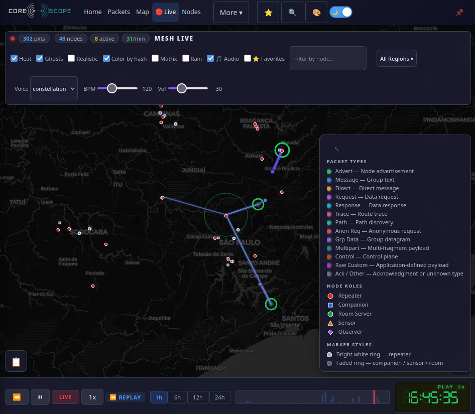

# Configurando um observador

Observadores tem um papel especial na rede MeshCore. Eles servem para escutar o tráfego da rede mesh e encaminhar os pacotes recebidos para um servidor central. Ou seja, ele tem como foco o monitoramento passivo que captura e registra a atividade da rede em sua região.

Se você tem um repetidor com chip baseado no ESP32 e acesso a um ponto de Wifi, este dispositivo é um ótimo candidato a se tornar um Observador. Continue lendo para saber mais.

## Como funciona o modo observador

Um dispositivo observador exerce normalmente sua função original. A diferença é que, além disso, ele se conecta diretamente à rede WiFi local e envia os dados que trafegam por ele para um servidor MQTT graças um firmware customizado. Isso permite que a comunidade tenha visibilidade sobre a cobertura e atividade da rede em diferentes localidades através da ferramenta [CoreScope](https://corescope.meshsorocaba.org). 



Visto que observadores fornecem os dados necessários para depurar problemas na rede, configurar um observer é uma excelente forma de contribuir para a comunidade.

Existem duas maneiras de fazer um dispositivo atuar como um observador:

- No caso de um **dispositivo repetidor**, ele deverá ter o firmware trocado por um firmware customizado e configurado para acessar o ponto WiFi.
- No caso de um **dispositivo pessoal** (companion), ele **não precisa ter o firmware customizado**, mas deverá permanecer conectado a um computador com conexão à Internet.

## Como transformar um repetidor em observador

1) Acesse o endereço [observer.gessaman.com](https://observer.gessaman.com). Atualmente, os navegadores que suportam a conexão com dispositivos via USB são o Chrome e o Firefox (nightly).

2) Selecione o modelo do seu dispositivo.

3) Escolha o modo de operação: `Repeater` (repetidor com uplink MQTT) ou `Room Server` (servidor de salas com uplink MQTT).

4) Selecione a versão do firmware disponível.

5) Clique em **Flash** para gravar o firmware diretamente pelo navegador. Se for a primeira vez que você grava esse firmware de observação no dispositivo, marque a opção **Erase device** para gravar o firmware mesclado (merged), que inclui o bootloader e a tabela de partições atualizada.

!!! danger "Atenção"

    Se você usa outro firmware atualmente, você precisará habilitar a opção **Erase Device** (apagar dispositivo), ou o repetidor apresentará comportamentos erráticos (falha de conexão com a Internet, falha em transmitir pacotes LoRa, etc). Esteja ciente também de que ao instalar o firmware _merged_ **você perderá as configurações atuais do seu dispositivo**. Não é necessário habilitar o Erase Device se você está apenas atualizando a versão.

    Caso você queira manter a mesma chave de identificação para esse dispositivo, lembre-se de obter a chave privada através do comando `get prv.key` no console do repetidor (comando somente acessível via USB).

## Configure o MQTT

O firmware Observer usa um sistema de **slots** (até 6 conexões MQTT simultâneas) com presets embutidos. Cada slot pode ser configurado com um broker conhecido (preset) ou com um broker personalizado (custom).

Recomendamos a seguinte configuração para observadores na nossa região:

| Slot | Broker | Preset | Descrição |
|------|--------|--------|-----------|
| 1 | `mqtt.meshsorocaba.org` | `custom` | Broker comunitário MeshCore Brasil |
| 2 | MeshMapper | `meshmapper` | Broker do MeshMapper (WSS + JWT) |

Os slots 3 a 6 podem ser deixados como `none` (desativados) ou configurados com outros presets, se desejar.

### Configuração via Console Serial

Acesse o console serial usando o [recurso Console do web flasher](https://flasher.meshcore.dev/) (ícone no canto superior direito da página) ou um terminal serial (115200 baud). Configure as propriedades conforme abaixo e depois reinicie o dispositivo.

**Configurações obrigatórias:**

```
set wifi.ssid nome_da_sua_rede
set wifi.pwd sua_senha_wifi
set mqtt.iata <código IATA do principal aeroporto da sua região>
set timezone America/Sao_Paulo
```

**Configurar o Slot 1 — Broker comunitário (mqtt.meshsorocaba.org):**

```
set mqtt1.preset custom
set mqtt1.server mqtt.meshsorocaba.org
set mqtt1.port 1883
set mqtt1.username meshcore
set mqtt1.password meshcore
```

**Configurar o Slot 2 — MeshMapper:**

```
set mqtt2.preset meshmapper
```

O preset `meshmapper` já configura automaticamente o servidor (`mqtt.meshmapper.cc:443`), a autenticação JWT (assinatura do dispositivo) e o transporte WSS. Não é necessário definir servidor, porta ou credenciais manualmente.

Placas sem PSRAM (como o **LilyGo T-LoRa V2.1–1.6** / TTGO LoRa32 V1.0) suportam **apenas uma conexão WSS/TLS ativa por vez**, pois cada conexão TLS exige cerca de 40 KB de memória heap. Nesse caso, configure o broker de sua preferência no Slot 1 e defina os demais slots como `none`. Dispositivos com PSRAM (como **Heltec V3**, **Heltec V4** e **Station G2**) suportam todos os slots ativos simultaneamente.

!!! info "Redundância"

    Conectar a ambos os brokers é recomendado, mas não obrigatório. O MeshMapper recebe dados de múltiplos brokers e elimina duplicatas automaticamente. Se quiser apenas o broker comunitário, configure o Slot 1 e deixe o Slot 2 como `none`.


**Configurações opcionais:**

```
set mqtt.owner <chave pública do seu nó companion>
set mqtt.email <seu e-mail>
```

`mqtt.owner` e `mqtt.email` são incluídos nos tokens JWT e visíveis publicamente como identificação do proprietário do observador.

**Reinicie para conectar:**

```
reboot
```

### Verificar a configuração

Após a reinicialização, verifique se tudo está correto:

```
get wifi.status
get mqtt.status
get mqtt1.preset
get mqtt2.preset
get mqtt.iata
get bridge.enabled
get mqtt.rx
get mqtt.tx
```

O comando `get mqtt.status` mostra o estado de conexão de cada slot. Se um slot estiver conectado, ele exibirá informações como o broker e o status da autenticação.

## Após a configuração

Depois que seu observador conectar e começar a enviar pacotes recebidos, pode levar até **5 minutos** para ele aparecer na lista de Observers no [CoreScope](https://corescope.meshsorocaba.org) e no dropdown de Regiões em toda a aplicação, e somente após um anúncio ser recebido do seu observador.

Se um anúncio não for recebido do seu observador, ele não aparecerá no dropdown de Observadores ou na página, mas ainda assim poderá enviar pacotes para a região selecionada.

## Solução de problemas

### Dispositivo não conecta ao WiFi

```
get wifi.ssid
get wifi.pwd
set wifi.powersave none
reboot
```

### Nenhuma mensagem MQTT está sendo enviada

```
get bridge.enabled
set bridge.enabled on
get mqtt.rx
set mqtt.rx on
get mqtt.status
get mqtt1.diag
get mqtt2.diag
```

O comando `get mqttN.diag` mostra os detalhes do último erro de cada slot (por exemplo, falhas de TLS, timeout de conexão etc.).

## Como transformar um companion em observador

Diferentemente de um repetidor, o companion **não precisa de firmware customizado**. Em vez disso, ele permanece conectado a um computador com acesso à Internet, e um script Python chamado [meshcore-packet-capture](https://github.com/agessaman/meshcore-packet-capture) captura os pacotes recebidos e os encaminha para os brokers MQTT.

O script se conecta ao companion via bluetooth (BLE), USB ou TCP, e oferece suporte a até 6 brokers MQTT simultâneos.

### Requisitos

- Python 3.7 ou superior
- Pacote `meshcore` (versão 2.2.2 ou superior)
- Pacote `paho-mqtt`
- Computador com conexão à Internet e acesso ao companion via BLE, USB ou TCP

### Instalação

No Linux, a forma mais simples é usar o instalador oficial:

```bash
bash <(curl -fsSL https://raw.githubusercontent.com/agessaman/meshcore-packet-capture/main/install.sh)
```

### Configuração

Toda a configuração é feita por variáveis de ambiente no arquivo `.env.local`

#### Conexão com o companion

Escolha o tipo de conexão e configure as variáveis correspondentes:

| Variável | Descrição |
|----------|-----------|
| `PACKETCAPTURE_CONNECTION_TYPE` | Tipo de conexão: `ble`, `serial` ou `tcp` |
| `PACKETCAPTURE_BLE_ADDRESS` | Endereço BLE do dispositivo (para conexão BLE) |
| `PACKETCAPTURE_BLE_DEVICE_NAME` | Nome BLE para escanear (alternativa ao endereço) |
| `PACKETCAPTURE_SERIAL_PORTS` | Porta serial, ex.: `/dev/ttyUSB0` (para conexão serial) |
| `PACKETCAPTURE_TCP_HOST` | Endereço do host TCP (padrão: `localhost`) |
| `PACKETCAPTURE_TCP_PORT` | Porta TCP (padrão: `5000`) |

#### Configuração dos brokers MQTT

Recomendamos a mesma configuração de brokers usada nos repetidores observadores:

**Slot 1 — Broker comunitário (mqtt.meshsorocaba.org):**

```bash
PACKETCAPTURE_MQTT1_ENABLED=true
PACKETCAPTURE_MQTT1_SERVER=mqtt.meshsorocaba.org
PACKETCAPTURE_MQTT1_PORT=1883
PACKETCAPTURE_MQTT1_USERNAME=meshcore
PACKETCAPTURE_MQTT1_PASSWORD=meshcore
```

**Slot 2 — MeshMapper:**

```bash
PACKETCAPTURE_MQTT2_ENABLED=true
PACKETCAPTURE_MQTT2_SERVER=mqtt.meshmapper.cc
PACKETCAPTURE_MQTT2_PORT=443
PACKETCAPTURE_MQTT2_TRANSPORT=websockets
PACKETCAPTURE_MQTT2_USE_TLS=true
PACKETCAPTURE_MQTT2_USE_AUTH_TOKEN=true
PACKETCAPTURE_MQTT2_TOKEN_AUDIENCE=mqtt.meshmapper.cc
```

O Slot 2 usa autenticação por token JWT, que exige a chave privada do dispositivo. Forneça a chave de uma das seguintes formas:

```bash
PACKETCAPTURE_PRIVATE_KEY=sua_chave_privada_em_hex
# ou
PACKETCAPTURE_PRIVATE_KEY_FILE=/caminho/para/arquivo_da_chave
```

Os Slots 3 a 6 seguem o mesmo padrão (`MQTT3_`, `MQTT4_`, etc.) e podem ser deixados desativados.

#### Outras configurações úteis

| Variável | Descrição | Padrão |
|----------|-----------|--------|
| `PACKETCAPTURE_IATA` | Código IATA do aeroporto da sua região | — |
| `PACKETCAPTURE_TIMEZONE` | Fuso horário | `America_Sao_Paulo` |
| `PACKETCAPTURE_LOG_LEVEL` | Nível de log (`DEBUG`, `INFO`, `WARNING`, `ERROR`) | `INFO` |
| `PACKETCAPTURE_ADVERT_INTERVAL_HOURS` | Intervalo de envio de adverts (0 = desativado) | `11` |
| `PACKETCAPTURE_STATS_IN_STATUS_ENABLED` | Incluir estatísticas (bateria, uptime, rádio) nas mensagens de status | `true` |

#### Exemplo completo de `.env.local`

```bash
PACKETCAPTURE_CONNECTION_TYPE=ble
PACKETCAPTURE_BLE_DEVICE_NAME=MeshCore

PACKETCAPTURE_IATA=SOD
PACKETCAPTURE_TIMEZONE=America/Sao_Paulo

PACKETCAPTURE_MQTT1_ENABLED=true
PACKETCAPTURE_MQTT1_SERVER=mqtt.meshsorocaba.org
PACKETCAPTURE_MQTT1_PORT=1883
PACKETCAPTURE_MQTT1_USERNAME=meshcore
PACKETCAPTURE_MQTT1_PASSWORD=meshcore

PACKETCAPTURE_MQTT2_ENABLED=true
PACKETCAPTURE_MQTT2_SERVER=mqtt.meshmapper.cc
PACKETCAPTURE_MQTT2_PORT=443
PACKETCAPTURE_MQTT2_TRANSPORT=websockets
PACKETCAPTURE_MQTT2_USE_TLS=true
PACKETCAPTURE_MQTT2_USE_AUTH_TOKEN=true
PACKETCAPTURE_MQTT2_TOKEN_AUDIENCE=mqtt.meshmapper.cc

PACKETCAPTURE_PRIVATE_KEY=sua_chave_privada_aqui
```

### Executando

Após configurar o `.env.local`, execute o script:

```bash
python packet_capture.py
```

Opções úteis na linha de comando:

| Opção | Descrição |
|-------|-----------|
| `--output arquivo.json` | Salva os pacotes em arquivo JSON |
| `--no-mqtt` | Desativa o envio para MQTT (útil para testes) |
| `--verbose` | Mostra os dados JSON dos pacotes no console |
| `--debug` | Saída detalhada de depuração |

### Usando Docker

Se preferir rodar em container, o projeto inclui suporte ao Docker Compose:

```bash
git clone https://github.com/agessaman/meshcore-packet-capture.git
cd meshcore-packet-capture
# Configure seu .env.local
docker-compose up -d
```

Para conexão serial via Docker:

```bash
docker run --privileged --device=/dev/ttyUSB0 \
  -v $(pwd)/data:/app/data \
  -e PACKETCAPTURE_CONNECTION_TYPE=serial \
  -e PACKETCAPTURE_SERIAL_PORTS=/dev/ttyUSB0 \
  meshcore-capture
```

!!! info "Plataformas e BLE"

    O suporte a BLE em containers Docker funciona melhor em **Linux**. No macOS o BLE é limitado dentro de containers, e no Windows ainda não é testado. Para conexões seriais ou TCP, não existe essa limitação.

### Solução de problemas

**BLE caindo com frequência:**

- Verifique se o dispositivo está próximo ao computador
- Aumente `PACKETCAPTURE_CONNECTION_RETRY_DELAY` para dar mais tempo de recuperação
- Configure `PACKETCAPTURE_MAX_CONNECTION_RETRIES=0` para tentativas infinitas

**MQTT não conecta:**

- Verifique as credenciais e o endereço do broker
- Use `--debug` para ver detalhes da conexão:

```bash
python packet_capture.py --debug
```

**Permissão negada na porta serial:**

```bash
sudo chmod 666 /dev/ttyUSB0
# ou adicione seu usuário ao grupo dialout
sudo usermod -a -G dialout $USER
```

## Precisa de ajuda?

Se você tiver problemas ou dúvidas, entre em contato com a comunidade no Telegram [MeshCore Brasil](https://t.me/meshcorebrasil).
