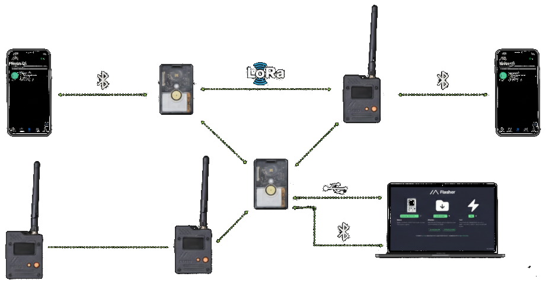

# Guia Rápido

## Como funciona uma rede mesh

Redes mesh, ou simplesmente malhas, funcionam como um sistema de mensagens que **não depende de wifi nem de sinal de celular**. Imagine uma conversa por WhatsApp, mas com a capacidade de enviar mensagens de texto que podem "saltar" de um dispositivo para outro até chegar ao destinatário sem depender da internet.

Cada dispositivo na rede é chamado de **nó**. Quando você envia uma mensagem, ela viaja de nó em nó até encontrar quem deve recebê-la. Quanto mais pessoas participam da rede com seus dispositivos, maior é o alcance e melhor funciona a comunicação para todos.

**Alguns pontos importantes:**

- **Alcance**: Um único dispositivo pode se comunicar a vários quilômetros de distância em linha de visada. Em área urbana com obstáculos, o alcance é menor, mas a rede se beneficia de múltiplos nós.
- **Privacidade**: As mensagens são criptografadas. Somente o destinatário, seja uma pessoa ou várias (em um canal), consegue ler o conteúdo.
- **Bateria**: Os dispositivos consomem pouca energia e podem funcionar por dias ou até meses com uma única carga, dependendo do modelo e uso.
- **Custo**: Não há mensalidade nem contrato. Você compra o dispositivo uma vez e usa à vontade.

## Escolhendo um dispositivo

Existem vários modelos de dispositivos compatíveis com o MeshCore e o Meshtastic. Via de regra, se um dispositivo é anunciado como feito para o Meshtastic, quase sempre funciona para o MeshCore também. Na dúvida, consulte-nos nos canais do Telegram.

### Dispositivos prontos para uso

São aparelhos que já vêm montados e prontos para usar — basta carregar a bateria e parear com o celular:

| Modelo | Preço Médio | Bateria | Tela | Observações |
| :--- | :--- | :--- | :--- | :--- |
| **Heltec V3** | R$ 300,00 | Não incluída | Sim | Menos recursos e consome mais bateria, porém mais barato. |
| **RAK WisMesh Tag** | R$ 400,00 | Incluída (até 1 semana) | Não | Compacto, ideal para carregar no bolso. |
| **RAK WisMesh Pocket** | R$ 500,00 | Incluída (até 1 semana) | Sim | Compacto, porém mais estável e robusto que os anteriores. |
| **Lilygo T-Echo** | R$ 600,00 | Incluída (até 3 dias) | Sim | Tela e-paper (tipo Kindle), fácil leitura mesmo no sol. |

O Heltec V3 normalmente é recomendado para iniciantes por ser mais barato. Porém, ele é baseado no chip ESP32 e consome bateria 15x mais rápido que dispositivos baseados no chip nRF52840 (como os da marca RAK), que são mais eficientes porém um pouco mais caros. Por outro lado, o chip nRF52840 não possui WiFi, então a conexão com celular só é possível via Bluetooth ou cabo USB.

!!! warning "Atenção"
    Na hora da compra, independente da marca do dispositivo, certifique-se que ele é capaz de transmitir na faixa de **915 MHz**.

### Antenas

A antena que acompanha o dispositivo geralmente é suficiente para uso comum, mas longe do ideal. Se quiser aumentar o alcance, é possível trocar por uma antena externa de maior ganho. A comunidade pode ajudar com recomendações.

## Onde comprar

Você pode encontrar dispositivos compatíveis com Meshtastic (e, consequentemente, MeshCore) em lojas internacionais e em alguns vendedores brasileiros:

### Lojas internacionais

- **AliExpress**: Grande variedade e preços competitivos. O prazo de entrega costuma ser de 2 a 8 semanas.
- **Amazon (EUA)**: Entrega mais rápida, mas frete mais caro.
- **Lilygo Store** (AliExpress): Loja oficial do fabricante Lilygo.

!!! warning "Atenção"
    Verifique se o dispositivo é compatível com a frequência **915 MHz**, que é a autorizada no Brasil. Alguns modelos são vendidos em frequências diferentes (como 868 MHz ou 433 MHz) e **não podem ser usados legalmente no país**.

### Vendedores nacionais

Alguns membros da comunidade Meshtastic Brasil revendem dispositivos já trazidos para o país. A vantagem é a entrega mais rápida e suporte em português. Consulte o grupo [Meshtastic Brasil no Telegram](https://t.me/meshtastic_br) para indicações atualizadas.

## Configuração inicial

Depois de adquirir seu dispositivo, escolha qual sistema instalar:

- Se você quer fazer uso extensivo de sensores (temperatura, luminosidade, umidade, etc.) e monitorá-los de forma rápida e fácil pela Internet, ou brincar com a troca de mensagens via rede mesh em pequenos grupos (acampamentos, shows, eventos), use o Meshtastic.
- Se você quer se dedicar à troca de mensagens com a comunidade de Sorocaba e região, com maior garantia de que suas mensagens chegarão ao destino, use o MeshCore.

**tl;dr** Ambos o MeshCore e o Meshtastic são sistemas de mensagens em mesh que oferecem a opção de mensagens públicas ou privadas (e criptografadas). O Meshtastic possui mais usuários, porém funciona melhor com pequenos grupos. O MeshCore possui um algoritmo de roteamento mais robusto, sendo mais indicado para a comunicação entre comunidades.

!!! info "Nota"
    Ambos os sistemas funcionam melhor quando um "nó" é instalado em uma localização mais privilegiada, como no telhado, na sacada de prédios ou em postes altos e dedicado somente à repetição de mensagens. Portanto, é aconselhável a aquisição de no mínimo dois dispositivos: um como repetidor, outro para dentro das residências ou uso móvel.

## Dúvidas frequentes

### Preciso de licença de radioamador?

**Não.** Os dispositivos Meshtastic operam na faixa de 915 MHz, que é destinada a dispositivos de baixa potência e não requer licenciamento específico no Brasil.

### Posso usar sem celular?

**Sim.** Alguns dispositivos possuem tela e podem funcionar de forma independente. O celular é usado principalmente para configurar o dispositivo e digitar mensagens mais confortavelmente.

### E se não houver ninguém por perto?

A rede cresce com a participação. Você pode ser o primeiro da sua região e, com o tempo, mais pessoas se juntam. Também existe a possibilidade de conectar-se via internet (MQTT) para interagir com a rede mesmo sem nós físicos próximos.

### Qual o alcance real?

Varia muito. Em campo aberto com linha de visada, pode ultrapassar 10 km. Em área urbana com prédios, o alcance é reduzido para alguns quilômetros ou menos. A presença de outros nós intermediários ajuda a estender a comunicação.

## Precisa de ajuda?

Entre em contato conosco pelo [Telegram](https://t.me/meshsorocaba) ou pela [comunidade Meshtastic Brasil](https://t.me/meshtastic_br). A comunidade é acolhedora e está sempre disposta a ajudar novos participantes.
