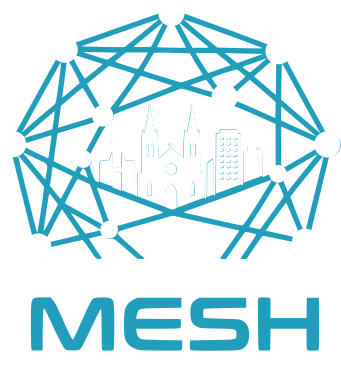

# 

/// caption
///

Esta página é dedicada ao **Mesh Sorocaba**, uma iniciativa comunitária que mantém uma **rede mesh** de comunicação; ou seja, que não depende da internet ou de sinal de celular. A troca de mensagens é feita 100% via rádios LoRa conectados a celulares ou notebooks (ou protótipos com teclado e tela independentes).

Nossa iniciativa visa integrar o município de Sorocaba e região: Votorantim, Salto de Pirapora, Araçoiaba da Serra, Iperó, Porto Feliz, Itu, Mairinque, Alumínio e além. Atualmente, também temos enlace com as regiões metropolitanas de São Paulo, Campinas e Jundiaí.

Para saber mais, leia o artigo [O que é uma rede mesh?](redes-mesh.md)

## Como funciona?

Para usufruir da rede, utilizamos dispositivos LoRa, que são transmissores de rádio de baixa potência e não exigem licença de radioamador. Esses dispositivos podem ser adquiridos prontos através de lojas online ou montados por conta própria com peças individuais. Consulte a página [Equipamento Recomendado](equipamento.md) para mais detalhes.

Uma vez que você tenha um dispositivo em mãos, você deverá instalar o software para poder utilizá-lo. A Mesh Sorocaba utiliza o MeshCore e o Meshtastic. Ambos os softwares tem código aberto e são distrubuídos livremente. Cada tecnologia é ideal, de sua própria maneira, para um cenário específico: o Meshtastic para pequenos grupos móveis e o MeshCore para redes estacionárias mas que se extende por várias cidades. **A Mesh Sorocaba recomanda o MeshCore como canal de comunicação oficial entre as cidades.** Apesar disso, convidamos a exploração de ambas as tecnologias.

Você pode saber mais detalhes sobre o funcionamento da rede [aqui](redes-mesh.md#como-funciona).

## Grupos no Telegram

Se você tem interesse em tecnologia, comunicação alternativa ou simplesmente quer se preparar para situações de emergência, junte-se a nós nos grupos do **Telegram**. Não é necessário conhecimento técnico avançado — estamos lá para ajudar:

- [Mesh Sorocaba](https://t.me/meshsorocaba)
- [MeshCore Brasil](https://t.me/meshcorebrasil)

## Contato

Para mais informações, entre em contato através dos canais mencionados, ou envie um e-mail para **contato** no domínio `meshsorocaba.org`.
