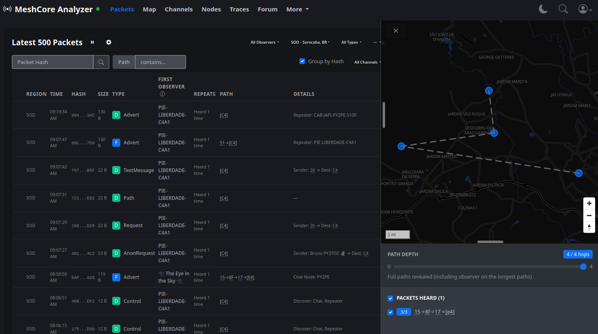
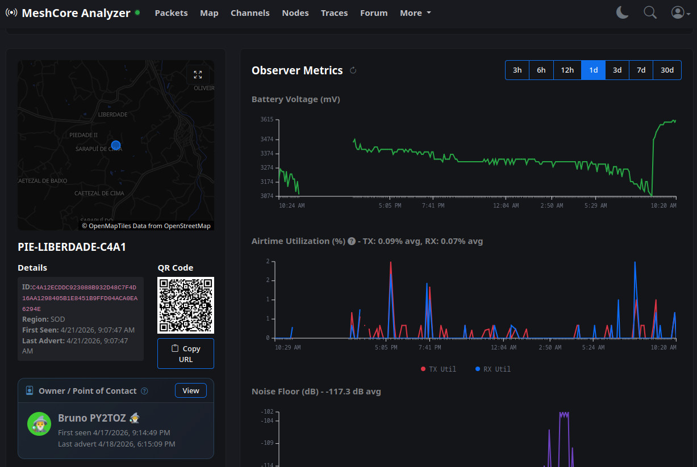

# Como Configurar um Observer no MeshCore

## O que é um Observer?

O dispositivo do tipo `Observer` tem um papel especial na rede MeshCore. Ele serve para escutar o tráfego da rede mesh e encaminhar os pacotes recebidos para um servidor central. Ou seja, ele tem como foco o monitoramento passivo que captura e registra a atividade da rede em sua região. 

Uma vez configurado, esse dispositivo pode exercer normalmente sua função de `Repeater` ou `Companion`. Mas além disso, ele se conecta diretamente à rede WiFi local ou através de computador ou Raspberry Pi e envia os dados coletados via protocolo MQTT para o servidor do [Let's Mesh](https://analyzer.letsmesh.net/packets?region=SOD), permitindo que a comunidade tenha visibilidade sobre a cobertura e atividade da rede em diferentes localidades. Com isso, outros usuários podem verificar quais regiões possuem observadores ativos e qual é o nível de atividade da rede em cada área.



Como um bônus, cada `Observer` ganha uma página própria no site onde é possível monitorar dados de telemetria. Isso faz com que a plataforma se torne bastante útil para administradores de repetidoras.



Configurar um `Observer` é uma excelente forma de contribuir com a rede mesh coletiva. Ao instalar um observador em sua localidade, você ajuda a mapear a extensão da rede, fornecendo dados valiosos sobre a cobertura do sinal e a frequência de comunicação entre dispositivos, permitindo que administradores da rede possam identificar possíveis problemas.


## Baixe o firmware do site Let's Mesh

1) Acesse o endereço [https://analyzer.letsmesh.net/observer/onboard](https://analyzer.letsmesh.net/observer/onboard)

2) Selecione o firmware de acordo com o modo como você deseja que o dispositivo opere: `Repeater` ou `Companion`. Se seu dispositivo possui WiFi integrado, é possível usá-lo como repetidor e, ao mesmo tempo, enviar os dados para o servidor sem necessidade de conectá-lo a um computador ou Raspberry Pi. Ele continua funcionando como um repetidor normalmente.

3) Em **Select Firmware Version** escolha a versão `observer-uplink-native-dev`.

4) Em **Select your device variant**, selecione o modelo do seu dispositivo.

5) Use o [MeshCore web flasher](https://flasher.meshcore.dev/) para gravar o firmware, selecionando a opção **Custom** e escolhendo o arquivo que você acabou de baixar.

## Configure o MQTT Uplink

Se você optou pela opção `Repeater`, este firmware experimental inclui capacidades nativas de WiFi e MQTT, então não são necessários dispositivos adicionais (como um Raspberry Pi).

### Configuração via Console Serial

Acesse o console serial usando o [recurso Console do web flasher](https://flasher.meshcore.dev/) (ícone no canto superior direito da página) ou um terminal serial. Configure as propriedades conforme abaixo e depois reinicie o dispositivo.

**Configurações obrigatórias:**

```
set wifi.ssid nome_da_sua_rede
set wifi.pwd sua_senha_wifi
set mqtt.iata <código IATA do principal aeroporto da sua região>
set mqtt.owner chave_publica_opcional_do_seu_nó_pessoal
set mqtt.email seu_email_opcional
set timezone.offset -3
set bridge.enabled on
set bridge.source rx
reboot
```

Substitua `nome_da_sua_rede`, `sua_senha_wifi` e `seu_email_opcional` pelos seus valores reais.

Para `mqtt.owner`, use a chave pública completa do seu nó companion (isso será exibido publicamente como o proprietário do observador).

Para `mqtt.iata`, use o código do aeroporto mais próximo da sua região (por exemplo, **SOD** para Sorocaba, **VCP** para Campinas, **GRU** para São Paulo, **QDV** para Jundiaí). **Deve ser um código IATA válido.** Para consultar a lista de códigos disponíveis, acesse a [Lista de aeroportos do Brasil por código aeroportuário](https://pt.wikipedia.org/wiki/Lista_de_aeroportos_do_Brasil_por_c%C3%B3digo_aeroportu%C3%A1rio_IATA).

## Após a configuração

Depois que seu observador conectar e começar a enviar pacotes recebidos, pode levar até **5 minutos** para ele aparecer na lista de Observers no site [Let's Mesh](https://analyzer.letsmesh.net/packets?region=SOD) e no dropdown de Regiões em toda a aplicação, e somente após um anúncio ser recebido do seu observador.

Se um anúncio não for recebido do seu observador, ele não aparecerá no dropdown de Observadores ou na página, mas ainda assim poderá enviar pacotes para a região selecionada.

## Precisa de ajuda?

Se você tiver problemas ou dúvidas, entre em contato com a comunidade no Telegram [MeshCore Brasil](https://t.me/meshcorebrasil).