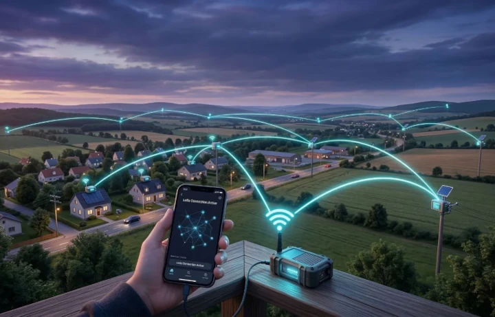
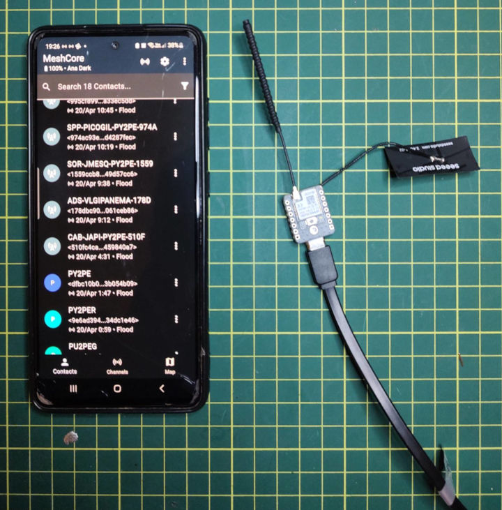
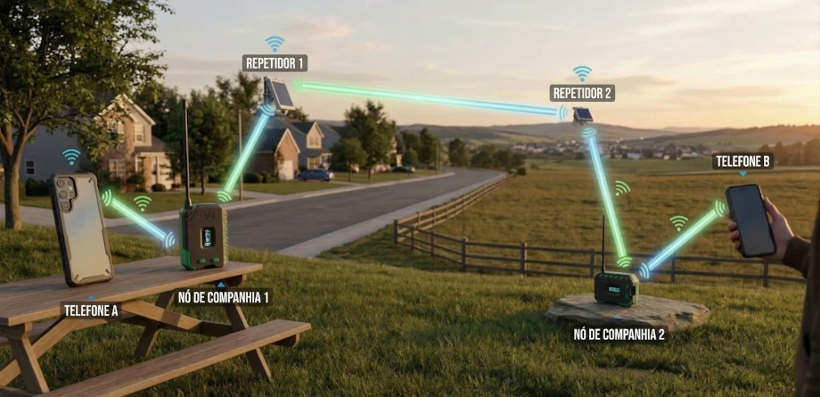

# O que são redes mesh?

/// caption
///

Uma **rede mesh** é aquela onde dispositivos participantes da rede retransmitem as mensagens que ouvem até que elas chegem aos seus destinatários. Dessa forma, a rede não depende de uma autoridade ou servidor central, como é o caso do WhatsApp ou SMS. A rede possui uma topologia totalmente horizontal onde **os usuários são os donos da própria infraestrutura**.

Redes mesh podem servir para mensagens privadas do dia-a-dia, comunicação de emergência ou qualquer outro fim que utilize mensagens de texto.

Apesar de serem utilizadas, em sua grande maioria, para comunicação de rotina em grandes cidades, as redes mesh também tem sido usadas para levar comunicação a locais sem infraestrutura, assim como comunicação emergencial em [cenários de catástrofes naturais](https://nodakmesh.org/blog/meshcore-emergency-preparedness).

## Como funciona?

Os dispositivos utilizados para a comunicação em uma rede mesh são baseados em placas de desenvolvimento ESP32 ou nRF52840 com chips de transmissão **LoRa** (_Long Range_). Esses dispositivos transmitem mensagens via rádio com baixa potência e não exigem licença de radioamador. Os dispositivos podem ser adquiridos já prontos, através de lojas online como Ali Express ou Mercado Livre, ou montados por conta própria. Consulte a página [Equipamento Recomendado](equipamento.md) para mais detalhes.

Uma vez que você tenha um dispositivo em mãos, você deverá instalar o software para poder utilizá-lo.  **A Mesh Sorocaba adota o MeshCore como firmware oficial**.

??? question "Por quê o MeshCore?"
    Em Sorocaba, além do MeshCore, há alguns usuários que utilizam o Meshtastic — outro software para a criação de redes mesh. Ambos têm código aberto e são distrubuídos livremente. Inicialmente tentamos utilizar o Meshtastic, mas numa análise mais aprofundada, concluímos que ele não escalaria tão bem quanto o MeshCore para cobrir várias cidades.

    Mais detalhes sobre a comparação entre o MeshCore e o Meshtastic podem ser lidos [aqui](blog/posts/meshtastic-vs-meshcore-por-que-as-grandes-comunidades-estao-mudando-de-plataforma.md).

## Material necessário

Para poder participar da rede MeshCore em Sorocaba e no resto do Brasil, o mínimo que você precisa é de:

- 1 dispositivo compatível com o protocolo LoRa em 915 MHz, com o [firmware do MeshCore](https://flasher.meshcore.io) instalado. Consulte a seção [Equipamento Recomendado](equipamento.md) para algumas sugestões de dispositivos.
- 1 antena ajustada para a banda de 33 cm (915 a 928 MHz).
- 1 fonte de energia (USB, solar, bateria, etc).
- 1 celular ou notebook com o app [MeshCore](https://play.google.com/store/apps/details?id=com.liamcottle.meshcore.android&hl=en_US) ou [meshcore-open](https://github.com/zjs81/meshcore-open).

/// caption
Um dispositivo 100% funcional e capaz de se conectar à rede MeshCore, conectado a um carregador de celular e pareado com o celular via bluetooth.
///

## Exemplo de funcionamento

/// caption
Exemplo de uma rede baseada no protocolo MeshCore.
///

-  **Dispositivos Finais (Telefone A e B):** São os aparelhos comuns (smartphones) onde o usuário digita e lê as mensagens
- **Nós de Companhia (_Companion Nodes_):** São a "ponte" entre o seu celular e a rede MeshCore. O seu telefone se conecta a um companion usando uma tecnologia de curto alcance que o aparelho já possui (como Bluetooth ou um Wi-Fi local, dependendo do modelo do dispositivo).
- **Repetidores:** São as "torres" da sua própria rede privada. Sinais de rádio viajam muito melhor quando não há obstáculos físicos bloqueando o caminho (o que em telecomunicações chamamos de "linha de visada"). Por isso, os repetidores são instalados em locais altos e abertos (como telhados ou mastros) e, como mostra a imagem, frequentemente usam painéis solares para funcionar de forma totalmente autônoma (off-grid).

Para entender a dinâmica, vamos acompanhar como uma mensagem sai do **Telefone A** e chega ao **Telefone B**:

1.  A pessoa no `Telefone A` escreve uma mensagem. O telefone envia essa mensagem sem fio (via Bluetooth/Wi-Fi) para o `Nó de Companhia 1`, que está fisicamente próximo a ele.
2.  O `Nó de Companhia 1` processa a mensagem e a transmite como um sinal de rádio.
3.  O sinal viaja até alcançar o `Repetidor 1`. O repetidor capta o sinal e o retransmite em direção ao próximo ponto da rede, que neste caso é o `Repetidor 2`.
4.  O `Repetidor 2` recebe o sinal e o direciona para baixo, alcançando o `Nó de Companhia 2`, que está no local de destino.
5.  O `Nó de Companhia 2` pega esse sinal de rádio, converte novamente para um formato que o celular entende e envia para o `Telefone B` (novamente via conexão local de curto alcance).

A grande vantagem de uma rede como essa é a resiliência e a expansibilidade. Você está essencialmente criando sua própria infraestrutura de comunicação, ponto a ponto. É ideal para áreas rurais, atividades ao ar livre (off-road, trilhas) ou cenários onde a comunicação tradicional falha. Porém, pode também ser usado como rede de emergência em larga escala quando bem planejada e com infraestrutura bem posicionada.

## Pontos importantes

- **Alcance**: Um único dispositivo pode se comunicar a vários quilômetros de distância em linha de visada. Em área urbana com obstáculos, o alcance é menor, mas a rede se beneficia de múltiplos nós.
- **Privacidade**: As mensagens são criptografadas. Somente o destinatário, seja uma pessoa ou várias (em um canal), consegue ler o conteúdo.
- **Bateria**: Os dispositivos consomem pouca energia e podem funcionar por dias ou até semanas com uma única carga, dependendo do modelo e uso.
- **Custo**: Não há mensalidade nem contrato. Você compra o dispositivo e usa à vontade.
- **Tipo de nó**: Existem vários tipos de nós na rede mesh, sendo os dois mais importante o pessoal/móvel (`companion`) e o repetidor (`repeater`). O `companion` é aquele que você carrega sempre consigo e é através dele que você pareia seu telefone ou computador e envia e recebe suas mensagens. apenas envia e recebe mensagens
